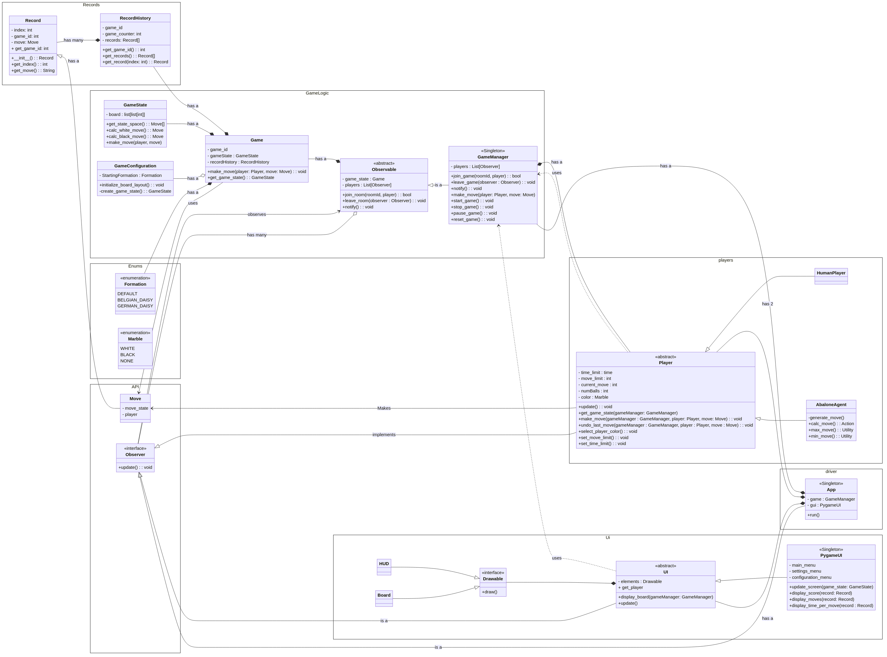

### Abalone Comp 3981 

- Cameron Fung (A01268094)
- Elsa Ho (A01332339)
- Callum Goss (A01328294)
- Joseph Driedger (A01320740)

## How to Run the State Space Generator on the BCIT Lab Computer
1. **Run Python on Apps Anywhere**
2. **Download and Unzip the zip file**
3. **Navigate to the \test\player\state_space_test folder**
4. **Place input files in the input folder. Output files will be in the output folder**
5. **Change the file path names in StateSpaceTest.py to test new files**
6. **Run command**
```python StateSpaceTest.py```

## How to Run the Game on the BCIT Lab Computer
1. **Run Python on Apps Anywhere**
2. **Unzip the zip file**
3. **Navigate to the /dist folder and run Abalone_Group2.exe**
   - Ignore the security warnings that pop up and click "run anyways" 

## How to Run on any computer

Follow these steps to set up and run the program:

1. **Create a Virtual Environment:**
    - Run the following command to create a virtual environment:
        ```bash
        python -m venv venv
        ```

2. **Activate the Virtual Environment:**
    - On Windows:
        ```bash
        .\venv\Scripts\activate.bat
        ```
    - On Unix:
        - Provide execute permissions to the activate script:
            ```bash
            chmod u+x venv/bin/activate
            ```
        - Activate the virtual environment:
            ```bash
            source venv/bin/activate
            ```

3. **Install Dependencies:**
    - Run the following command to install the required dependencies:
        ```bash
        pip install -r requirements.txt
        pip install pyinstaller
        ```

4. **Export Python Driver to Executable File:**
    - Execute the program using the following command:
        ```
        pyinstaller --onefile driver.py --name Abalone_Group2 --noconsole
        ```

5. **Copy assets to correct**
    - Create a new folder called app inside ./dist
    - Copy the following folders into ./dist/app
        - formations
        - gameplay
        - images

6. **Run the program and Have Fun.**
    - Open the dist directory
    - Open Abalone_Group2.exe
  



